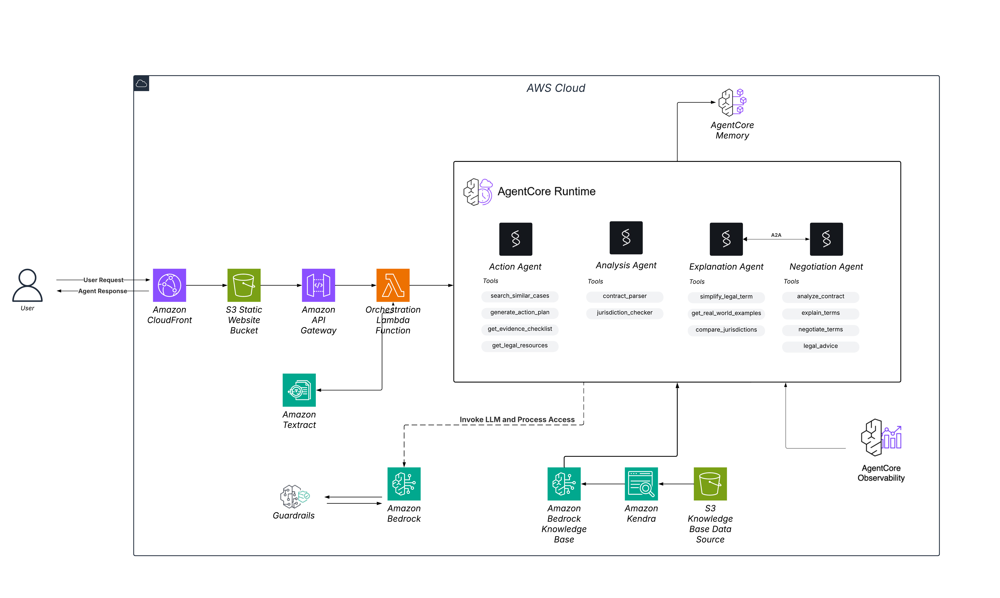

# 🤖 FreeLegal AI - Freelancer Legal Assistant

> **AI-powered legal assistant helping freelancers navigate contracts, payment disputes, and negotiations without expensive lawyers.**


**AWS Bedrock Hackathon 2025**

---

## 🎯 What It Does

FreeLegal AI helps freelancers worldwide analyze contracts in 60 seconds, understand legal terms, and negotiate better deals—without expensive lawyers.

**Key Benefits:**
- ✅ Analyze contracts for unfair clauses and hidden risks
- 📖 Understand complex legal jargon in plain English
- 🤝 Negotiate better terms with data-backed counter-proposals
- ⚡ Get instant answers to urgent legal questions
- 🌍 Jurisdiction-specific legal guidance powered by RAG

---

## ✨ Core Features

### 🤖 4 Specialized AI Agents

| Agent | Purpose | Example |
|-------|---------|---------|
| **⚡ Action Agent** | Immediate help for urgent issues | "My client won't pay $5000 - what do I do NOW?" |
| **🔍 Analysis Agent** | Contract review & red flag detection | "Is this payment term fair? What's risky?" |
| **💡 Explanation Agent** | Legal terms in plain English | "What does 'force majeure' mean?" |
| **🤝 Negotiation Agent** | Tactical advice for pushback | "How do I negotiate better payment terms?" |

### 🚀 Platform Capabilities

- **Contract Upload**: Drag & drop PDF/TXT contracts for instant analysis
- **AWS Textract Integration**: Automatic text extraction from PDFs
- **RAG-Powered Legal Knowledge**: AWS Bedrock Knowledge Bases with S3-stored laws and regulations
- **Context-Aware Responses**: Agents reference your uploaded contract and jurisdiction-specific laws
- **Session Memory**: AWS AgentCore maintains conversation context
- **Observability**: Full AgentCore monitoring and logging
- **Responsive Design**: Works seamlessly on desktop & mobile

---

## 🏗️ Architecture



### System Flow

```
User Contract (PDF/TXT)
    ↓
AWS Textract (Text Extraction)
    ↓
┌─────────────────────────────────────┐
│   AWS Bedrock Knowledge Bases       │
│   ├─ KB 9LRYYFY2BR (Contract Types) │
│   └─ KB XNHMT6VAJC (Freelance Laws) │
└─────────────────────────────────────┘
    ↓
┌─────────────────────────────────────┐
│   AWS AgentCore Runtime (5 Agents)  │
│   ├─ Action Agent                   │
│   ├─ Analysis Agent                 │
│   ├─ Explanation Agent              │
│   ├─ Negotiation Agent              │
│   └─ Orchestration Layer            │
└─────────────────────────────────────┘
    ↓
Final Report + Recommendations
```

### Tech Stack

#### Core Services
```
├─ AWS Bedrock (Claude 3.5 Sonnet v2, Nova Pro)
├─ AWS Bedrock AgentCore Runtime (5 agents)
├─ AWS Lambda (Python 3.12)
├─ AWS API Gateway (REST API)
├─ AWS S3 (Static hosting + document storage)
├─ AWS CloudFront (CDN)
├─ AWS Textract (PDF text extraction)
├─ AWS Bedrock Knowledge Base (2 KBs)
│   ├─ KB 9LRYYFY2BR (Contract Types)
│   └─ KB XNHMT6VAJC (Freelance Laws)
└─ AWS AgentCore Browser Tool
```

#### External Integrations
```
├─ DuckDuckGo Search API (web search)
├─ Case.law API (Harvard Law School legal database)
└─ PDF.js (Mozilla - client-side PDF parsing)
```

#### Protocols
```
├─ A2A Protocol (Agent-to-Agent communication)
└─ JSON-RPC 2.0 (message format)
```

---

## 🤖 AI Agents & Tools

All agents are deployed on **AWS Bedrock AgentCore** with:
- ✅ **AgentCore Memory**: Maintains conversation context across sessions
- ✅ **AgentCore Observability**: Full monitoring, logging, and debugging
- ✅ **Tool Integration**: Custom tools for specialized tasks

### ⚡ Action Agent

**Purpose**: Provide immediate, jurisdiction-specific action plans for urgent legal issues

**Interaction Flow**:
```
User: "My client won't pay"
Bot: "I need a few details to help you:
     - Which country are you in?
     - How much are you owed?
     - How long has it been?"

User: "Country is Egypt, 1000$, 2 weeks"
Bot: ⚡ ACTION PLAN: Non-Payment in Egypt
     
     Thank you for providing those details. 
     Here's your specific action plan for recovering 
     $1,000 from a client in Egypt...
     [Full Egypt-specific guidance]
```

**Tools**:

```python
@tool
def search_similar_cases(issue_type, jurisdiction, contract_text):
    """
    Uses DuckDuckGo Search API + Case.law API (Harvard Law)
    to find similar legal cases and precedents
    """

@tool
def generate_action_plan(issue_description, jurisdiction, 
                        amount_at_stake, days_since_issue):
    """
    Uses AWS Bedrock (Claude 3.5 Sonnet) to generate 
    personalized action plans based on jurisdiction
    """

@tool
def get_evidence_checklist(issue_type):
    """
    Static structured data (no external API)
    Returns checklist of evidence to collect
    """

@tool
def get_legal_resources(jurisdiction, issue_type, amount_at_stake):
    """
    Static jurisdiction-specific resource links
    (courts, legal aid, arbitration services)
    """
```

---

### 🔍 Analysis Agent

**Purpose**: Deep contract analysis with jurisdiction-specific compliance checking

**Tools**:

```python
@tool
def contract_parser(contract_text):
    """
    Uses Bedrock Knowledge Base 9LRYYFY2BR (Contract Types)
    to identify contract structure and key clauses
    """

@tool
def jurisdiction_checker(clause_text, clause_type, jurisdictions):
    """
    Uses Bedrock Knowledge Base XNHMT6VAJC (Freelance Laws)
    to validate clause legality across jurisdictions
    """

@tool
def enhanced_jurisdiction_checker(clause_text, clause_type, jurisdiction):
    """
    Uses AWS AgentCore Browser Tool (web validation)
    for real-time legal compliance checking
    """
```

---

### 💡 Explanation Agent

**Purpose**: Translate complex legal terminology into plain English

**Tools**:

```python
@tool
def simplify_legal_term(term, context):
    """
    Uses Claude to translate legal → plain English (8th-grade level)
    """

@tool
def get_real_world_examples(term):
    """
    Uses Knowledge Base for case examples
    showing how terms apply in practice
    """

@tool
def compare_jurisdictions(term, jurisdictions):
    """
    Uses Knowledge Base for jurisdiction differences
    (e.g., how "force majeure" varies by country)
    """
```

---

### 🤝 Negotiation Agent

**Purpose**: Generate tactical negotiation strategies with specific talking points

**Tools**:

```python
@app.action
def analyze_contract(payload):
    """Analyze contract for negotiable issues"""

@app.action
def explain_terms(payload):
    """Explain terms in simple language"""

@app.action
def negotiate_terms(payload):
    """Generate negotiation strategies with scripts"""

@app.action
def legal_advice(payload):
    """Provide legal guidance for negotiations"""
```

---

## 📂 Project Structure

```
freelegal-ai/
├── src/
│   ├── agents/
│   │   ├── action/                # Action Agent + tools
│   │   ├── analysis/              # Analysis Agent + tools
│   │   ├── explanation/           # Explanation Agent + tools
│   │   └── negotiation/           # Negotiation Agent + tools
│   ├── orchestration/             # Agent routing & coordination
│   ├── frontend/                  # Static website
│   │   ├── index.html             # Landing page
│   │   ├── chat-action.html       # Action agent interface
│   │   ├── chat-analysis.html     # Analysis agent (with upload)
│   │   ├── chat-explanation.html  # Explanation agent
│   │   ├── chat-negotiation.html  # Negotiation agent
│   │   └── static/
│   │       ├── css/               # Styles
│   │       └── js/                # JavaScript
│   └── infrastructure/            # AWS configuration
├── knowledge_bases/
│   ├── contract_types/            # KB 9LRYYFY2BR
│   └── freelance_laws/            # KB XNHMT6VAJC
├── docs/                          # Implementation guides
└── README.md
```

---

## 🚀 Quick Start

### Prerequisites

- AWS Account with access to:
  - Bedrock, AgentCore, Lambda, S3, CloudFront
  - Textract, Knowledge Bases
- AWS CLI configured
- Python 3.12+

### Installation

```bash
# Clone repository
git clone <repository-url>
cd freelegal-ai

# Install dependencies
pip install -r requirements.txt
```

### Usage

1. **Access the platform** via your deployment URL
2. **Choose an agent** based on your need
3. **Upload your contract** (Analysis Agent)
4. **Ask questions** and get instant AI-powered advice

---

## 🎨 Features in Detail

### RAG-Powered Legal Knowledge

**AWS Bedrock Knowledge Bases**:
- **KB 9LRYYFY2BR**: Contract types, standard clauses, industry benchmarks
- **KB XNHMT6VAJC**: Freelance laws by jurisdiction, compliance requirements

**Benefits**:
- Jurisdiction-specific legal guidance
- Up-to-date legal information
- Reduced hallucinations with grounded responses
- Real-time validation via AgentCore Browser Tool

### AWS Textract Integration

- Server-side PDF text extraction
- Handles scanned documents and images
- Preserves document structure
- High accuracy for legal documents

### AgentCore Memory & Observability

**Memory**:
- Conversation context maintained across messages
- Session persistence until explicit reset
- Cross-agent context sharing

**Observability**:
- Full request/response logging
- Tool invocation tracking
- Performance metrics
- Error monitoring and debugging

### Multi-Agent Communication

**A2A Protocol**:
- Agents can communicate with each other
- Coordinated analysis across specializations
- Shared knowledge base access

**JSON-RPC 2.0**:
- Standardized message format
- Error handling
- Request/response correlation

---

## 🔒 Security

- AWS IAM role-based access control
- S3 private buckets for document storage
- Encrypted data in transit (HTTPS)
- CORS-enabled API with proper headers
- No sensitive data stored in frontend
- AgentCore security best practices

---

## 🌟 Why FreeLegal AI?

**Traditional Solution**: Hire a lawyer ($300-500/hour) ❌  
**Our Solution**: FreeLegal AI (instant, accessible) ✅

**The Problem**:
- 💸 73% of freelancers face payment issues
- 📄 Most can't afford legal review ($500+ per contract)
- ⚖️ Legal jargon creates information asymmetry
- 🤝 Freelancers lack negotiation confidence

**Our Impact**:
- Save $500+ per contract review
- Get answers in 60 seconds vs 3-5 business days
- Understand contracts without law degree
- Negotiate from position of knowledge
- Jurisdiction-specific legal guidance
- 

---

## 📄 License

This project is licensed under the MIT License - see the LICENSE file for details.


# Contributors [`⇧`](#contents)

Thanks to all our amazing contributors! ❤️

<a href="https://github.com/mustafatawfiq">
  
</a>
<a href="https://github.com/lola-16">
  
</a>
<a href="https://github.com/mennamohammeddd">
  
</a>
<a href="https://github.com/OmarAI2003">
  
</a>


